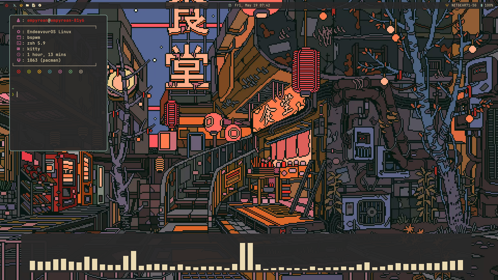

# Bspwm

Bspwm configuration files

**This is an experimental Lua rewrite, and is not production ready! DO NOT DAILY DRIVE!**

## Dependencies

### Required

- **Bspwm (Window manager):** https://github.com/baskerville/bspwm
- **Sxhkd (Hotkey daemon):** https://github.com/baskerville/sxhkd
- **Polybar (Status bar):** https://github.com/polybar/polybar
- **Kitty (Terminal emulator):** https://github.com/kovidgoyal/kitty
- **Polkit Gnome (Run as root):** https://gitlab.gnome.org/Archive/policykit-gnome
- **Picom (Compositor):** https://github.com/yshui/picom

### Optional (Highly recommended)

- **Rofi (Launcher):** https://github.com/DaveDavenport/rofi
- **Dunst (Notification daemon):** https://dunst-project.org/
- **Nitrogen (Wallpaper setter):** https://github.com/l3ib/nitrogen/
- **Numlockx (Enable number lock):** https://github.com/rg3/numlockx

## Install

### Arch based distros

**Install the required dependencies**

```pacman -Syu && pacman -S bspwm sxhkd polybar kitty polkit-gnome picom```

**If desired install the option dependencies**

```pacman -S rofi dunst nitrogen numlockx```

**Backup your old configurations**

```cp -r ~/.config/bspwm/ ~/.config/bspwm.bak/```

**Clone this repository**

```git clone https://github.com/Empyrean-Void/bspwm.git ~/.config/bspwm/```

## Configuration

- For Sxhkd and Kitty to work properly, create the following symlinks

```ln -s ~/.config/bspwm/sxhkdrc ~/.config/sxhkd/```

```ln -s ~/.config/bspwm/kitty/kitty.conf ~/.config/kitty/```

```ln -s ~/.config/bspwm/kitty/colors.conf ~/.config/kitty/```

## Screenshots

**Gruvbox**


