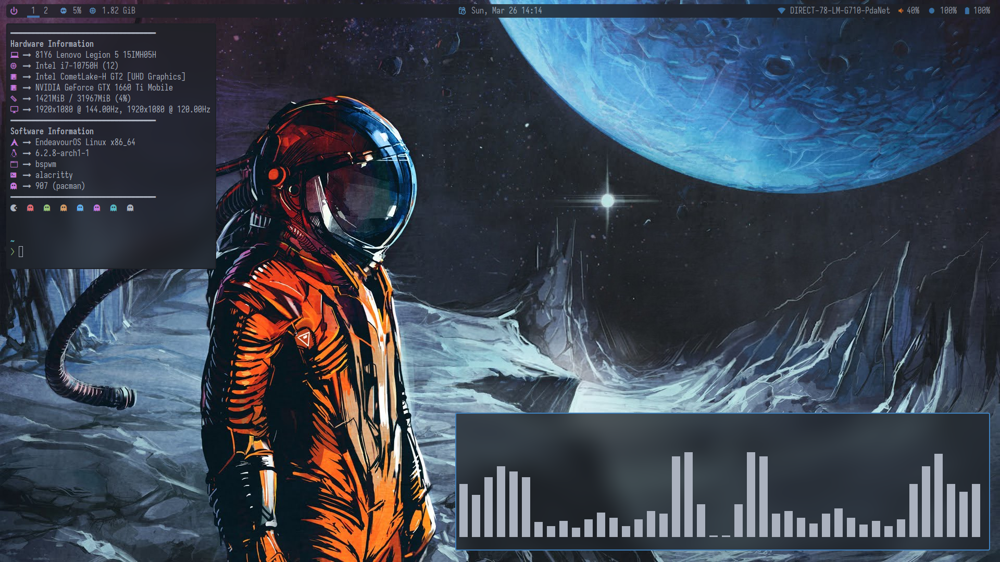

# Bspwm

Dotfiles for my Bspwm rice.

## Dependencies

- **Bspwm** (Window manager)
- **Sxhkd** (Shortcut daemon)
- **Polybar** (Panel)
- **Nitrogen** (Wallpaper)
- **Picom** (Compositor)
- **Numlockx** (Enable num lock)
- **Polkit Gnone** (polkit)

## Install

- Install the needed dependencies:

`yay -S bspwm sxhkd polybar nitrogen picom numlockx polkit-gnome`

- Backup your old Bspwm config (if applicable):

`mv ~/.config/bspwm/ ~/.config/bspwm.bak/`

- Clone this repository:

`git clone --depth-1 https://github.com/Empyrean-Void/bspwm.git ~/.config/bspwm/`

## Screenshots

## Extras

For a complete setup, visit my other repositories.

- [**Polybar**](https://github.com/Empyrean-Void/polybar.git)
- [**Rofi**](https://github.com/Empyrean-Void/rofi.git)
